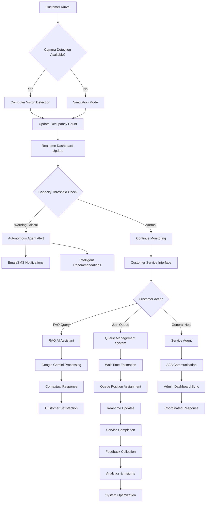
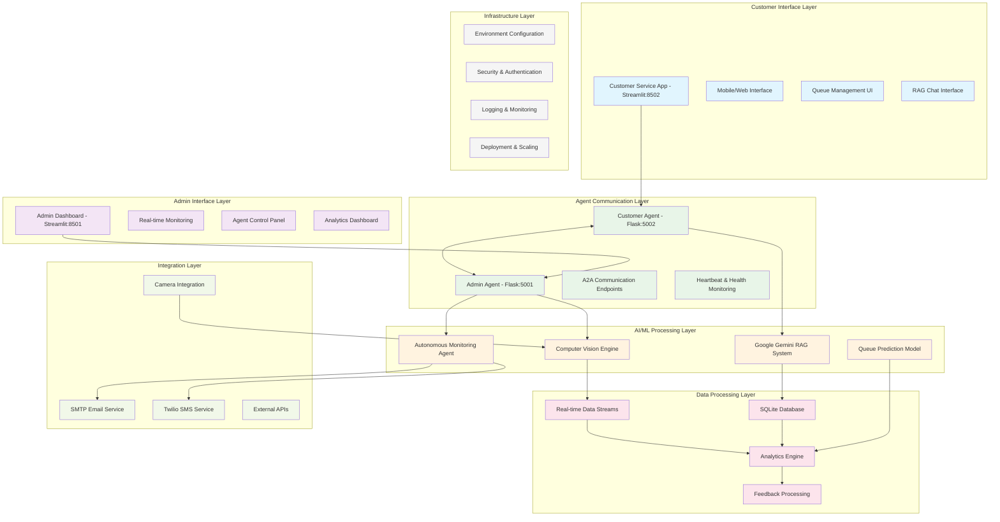

# Smart Branch: Problem Statement, Flow Chart & Architecture

## Problem Statement

### Current Challenges in Traditional Branch Operations

**1. Inefficient Queue Management**
- Long waiting times with no visibility into queue status
- No real-time wait time estimates for customers
- Manual queue management leading to operational inefficiencies
- Poor customer experience due to uncertainty

**2. Limited Customer Service Support**
- Repetitive FAQ queries consuming staff time
- No 24/7 customer support availability
- Inconsistent information delivery across different staff members
- Language barriers and communication issues

**3. Poor Occupancy & Footfall Monitoring**
- No real-time visibility into branch occupancy levels
- Lack of data-driven insights for capacity planning
- Manual counting systems prone to errors
- No predictive analytics for peak hour management

**4. Reactive Operations Management**
- No proactive alerts for capacity thresholds
- Limited automation in monitoring and reporting
- Disconnected systems leading to information silos
- No intelligent recommendations for operational improvements

### Proposed Solution: Smart Branch System

A **dual-app intelligent system** that leverages AI agents, computer vision, and real-time communication to transform traditional branch operations into smart, autonomous, and customer-centric services.

**Key Value Propositions:**
- **Real-time Intelligence**: Live occupancy monitoring with predictive analytics
- **Autonomous Operations**: AI agents handling routine tasks and alerts
- **Enhanced Customer Experience**: AI-powered FAQ system with instant responses
- **Seamless Integration**: Agent-to-agent communication for coordinated operations
- **Scalable Architecture**: Modular design supporting future enhancements

---

## System Flow Chart



---

## Detailed Architecture Diagram



---

## Technical Architecture Components

### 1. **Frontend Applications**
- **Admin Dashboard (app1.py)**: Streamlit-based monitoring interface
- **Customer Service (app2.py)**: Streamlit-based customer interaction platform
- **Responsive Design**: Mobile-friendly interfaces for all user types

### 2. **Backend Services**
- **Flask Agents**: Lightweight HTTP services for A2A communication
- **Real-time Processing**: Live data streams and event handling
- **Database Layer**: SQLite for persistence with planned PostgreSQL migration

### 3. **AI/ML Components**
- **RAG System**: Google Gemini-powered FAQ assistant with vector search
- **Computer Vision**: OpenCV-based occupancy detection and analytics
- **Predictive Models**: Queue wait time estimation and capacity planning
- **Autonomous Agents**: LangChain/LangGraph-based intelligent monitoring

### 4. **Communication Infrastructure**
- **A2A Protocol**: RESTful APIs for inter-agent communication
- **Real-time Updates**: WebSocket-like streaming for live data
- **External Integrations**: SMTP, SMS, and third-party service APIs

### 5. **Data & Analytics**
- **Time-series Data**: Occupancy tracking and historical analytics
- **Customer Insights**: Feedback analysis and satisfaction metrics
- **Operational Intelligence**: Performance monitoring and optimization recommendations

---

## Key Dependencies & Technologies

### Core Framework Stack
```
Streamlit >= 1.28.0          # Web UI Framework
Flask                        # Agent Communication
OpenCV >= 4.8.0             # Computer Vision
SQLite                       # Database (built-in Python)
```

### AI/ML Stack
```
google-generativeai >= 0.3.0  # RAG System
langchain >= 0.1.0            # Agent Framework
langgraph >= 0.0.40           # Agent Workflows
scikit-learn >= 1.3.0         # ML Models
```

### Data Processing
```
pandas >= 2.0.0              # Data Manipulation
numpy >= 1.24.0              # Numerical Computing
plotly >= 5.15.0             # Interactive Visualizations
```

### Integration Services
```
twilio >= 8.0.0              # SMS Notifications
python-dotenv >= 1.0.0       # Environment Management
requests                     # HTTP Client
```

---

## Deployment Architecture

### Development Environment
```
localhost:8501 → Admin Dashboard
localhost:8502 → Customer Service
localhost:5001 → Admin Agent API
localhost:5002 → Customer Agent API
```

### Production Considerations
- **Load Balancing**: Nginx reverse proxy for Streamlit apps
- **Process Management**: Systemd/PM2 for service management
- **Security**: HTTPS, API authentication, rate limiting
- **Monitoring**: Health checks, logging, and alerting systems
- **Scalability**: Horizontal scaling support for high-traffic scenarios

---

## Success Metrics & KPIs

### Operational Efficiency
- **Reduced Wait Times**: Target 30% reduction in average queue time
- **Increased Throughput**: 25% improvement in customer service capacity
- **Staff Productivity**: 40% reduction in routine FAQ handling

### Customer Experience
- **Satisfaction Score**: Target 4.5+ star rating
- **Response Time**: <2 seconds for FAQ queries
- **Queue Visibility**: 100% real-time wait time accuracy

### System Performance
- **Uptime**: 99.9% system availability
- **Response Time**: <500ms API response times
- **Accuracy**: 95%+ computer vision detection accuracy

---

## Implementation Guide

### Step-by-Step Setup Process

#### 1. Environment Setup
```bash
# Clone the repository
git clone https://github.com/Sukesh2003/smart-branch.git
cd smart-branch

# Create virtual environment
python3 -m venv .venv
source .venv/bin/activate  # Linux/macOS
# or .venv\Scripts\Activate.ps1  # Windows

# Install dependencies
pip install -r requirements.txt
```

#### 2. Environment Configuration
Create a `.env` file in the project root:

```env
# General Configuration
CAPACITY_MAX=200

# SMTP Configuration (for alerts & reports)
SMTP_HOST=smtp.example.com
SMTP_PORT=465
SMTP_USER=you@example.com
SMTP_PASS=your_email_password
FROM_EMAIL=you@example.com

# App Communication Endpoints
APP2_ENDPOINT=http://localhost:8502
APP1_ENDPOINT=http://localhost:5001
QUEUE_AGENT_PORT=5001
CUSTOMER_AGENT_PORT=5002

# Camera Configuration
ENTRANCE_CAMERA_INDEX=0
EXIT_CAMERA_INDEX=1
USE_SINGLE_CAMERA=true

# Optional Services
ENABLE_NOTIFICATIONS=true
GOOGLE_API_KEY=your_gemini_api_key_here
TWILIO_ACCOUNT_SID=
TWILIO_AUTH_TOKEN=
TWILIO_PHONE_NUMBER=
```

#### 3. Database Initialization

**Create `create_database.py`:**
```python
import sqlite3
import os
from pathlib import Path

def create_database():
    """Initialize the Smart Branch database"""
    # Create data directory
    db_path = Path("data")
    db_path.mkdir(exist_ok=True)
    
    conn = sqlite3.connect('data/database.db')
    cursor = conn.cursor()
    
    # Create users table
    cursor.execute('''
        CREATE TABLE IF NOT EXISTS users (
            id INTEGER PRIMARY KEY AUTOINCREMENT,
            username TEXT UNIQUE NOT NULL,
            password_hash TEXT NOT NULL,
            name TEXT NOT NULL,
            email TEXT,
            phone TEXT,
            age INTEGER,
            gender TEXT,
            face_id TEXT,
            created_at DATETIME DEFAULT CURRENT_TIMESTAMP
        )
    ''')
    
    # Create queue entries table
    cursor.execute('''
        CREATE TABLE IF NOT EXISTS queue_entries (
            id INTEGER PRIMARY KEY AUTOINCREMENT,
            user_id INTEGER,
            join_time DATETIME DEFAULT CURRENT_TIMESTAMP,
            estimated_wait INTEGER,
            actual_wait INTEGER,
            status TEXT DEFAULT 'waiting',
            position INTEGER,
            FOREIGN KEY (user_id) REFERENCES users (id)
        )
    ''')
    
    # Create feedback table
    cursor.execute('''
        CREATE TABLE IF NOT EXISTS feedback (
            id INTEGER PRIMARY KEY AUTOINCREMENT,
            user_id INTEGER,
            rating INTEGER,
            comments TEXT,
            created_at DATETIME DEFAULT CURRENT_TIMESTAMP,
            FOREIGN KEY (user_id) REFERENCES users (id)
        )
    ''')
    
    # Create chat history table
    cursor.execute('''
        CREATE TABLE IF NOT EXISTS chat_history (
            id INTEGER PRIMARY KEY AUTOINCREMENT,
            user_id INTEGER,
            question TEXT NOT NULL,
            answer TEXT NOT NULL,
            created_at DATETIME DEFAULT CURRENT_TIMESTAMP,
            FOREIGN KEY (user_id) REFERENCES users (id)
        )
    ''')
    
    # Create indexes
    cursor.execute('CREATE INDEX IF NOT EXISTS idx_users_username ON users(username)')
    cursor.execute('CREATE INDEX IF NOT EXISTS idx_chat_user ON chat_history(user_id)')
    
    conn.commit()
    conn.close()
    print("Database initialized successfully!")

if __name__ == "__main__":
    create_database()
```

**Run the database setup:**
```bash
python create_database.py
```

#### 4. Application Startup Sequence

**Terminal 1 - Start Customer Service (FIRST):**
```bash
streamlit run app2.py --server.port 8502
```

**Terminal 2 - Start Admin Dashboard (SECOND):**
```bash
streamlit run app1.py --server.port 8501
```

#### 5. System Initialization
1. Open Admin Dashboard: http://localhost:8501
2. Navigate to "Autonomous Agent" tab
3. Click "Detect Available Cameras"
4. Start the queue agent
5. Test Customer Service: http://localhost:8502

### Configuration Details

#### Port Configuration Table
| Service | Default Port | Purpose |
|---------|--------------|---------|
| Admin Streamlit | 8501 | Web interface for monitoring |
| Customer Streamlit | 8502 | Customer-facing interface |
| Admin Agent (Flask) | 5001 | A2A communication endpoints |
| Customer Agent (Flask) | 5002 | A2A communication endpoints |

#### API Endpoints Reference

**Admin Agent (Port 5001):**
- `GET /health` - Health check
- `POST /handshake` - Agent handshake
- `POST /receive_message` - A2A message handling
- `POST /heartbeat` - Heartbeat signals

**Customer Agent (Port 5002):**
- `GET /health` - Health check
- `POST /handshake` - Agent handshake  
- `POST /receive_message` - A2A message handling
- `POST /heartbeat` - Heartbeat signals

### Testing & Validation

#### Health Check Commands
```bash
# Test admin agent
curl http://localhost:5001/health

# Test customer agent  
curl http://localhost:5002/health

# Test customer Streamlit app health
curl http://localhost:8502/health
```

#### Testing Workflow
1. Start both applications in correct order
2. Use customer app to join queue
3. Monitor real-time updates in admin dashboard
4. Verify A2A communication status in admin UI
5. Test FAQ system with sample queries
6. Validate camera detection or simulation mode

### Project File Structure
```
smart-branch/
├── app1.py                 # Admin dashboard & monitoring agent
├── app2.py                 # Customer service & RAG assistant
├── create_database.py      # Database initialization script
├── requirements.txt        # Python dependencies
├── .env                    # Environment configuration
├── .env.example           # Example environment file
├── data/                  # Database directory
│   └── database.db        # SQLite database
└── README.md              # Documentation
```

### Troubleshooting Guide

#### Common Issues & Solutions

**Connection Problems:**
- Ensure app2 is running before starting app1
- Verify endpoint URLs in `.env` file
- Check firewall settings for configured ports

**Camera Detection Issues:**
- System automatically falls back to simulation mode
- Adjust `ENTRANCE_CAMERA_INDEX` and `EXIT_CAMERA_INDEX` in `.env`
- Ensure camera permissions are granted

**RAG Assistant Not Working:**
- Verify `GOOGLE_API_KEY` is set correctly
- System falls back to static responses without API key
- Check Gemini API quota and billing

**Email Alerts Not Sent:**
- Verify all SMTP configuration in `.env`
- Test with simple SMTP client first
- Check email provider's security settings

### Production Deployment Considerations

1. **Environment-specific Configuration:**
   - Use separate `.env` files for dev/staging/prod
   - Configure secure secrets management

2. **Reverse Proxy Setup:**
   - Nginx configuration for Streamlit apps
   - SSL/TLS termination and HTTPS enforcement

3. **Process Management:**
   - Systemd services for Linux deployment
   - PM2 for Node.js-style process management
   - Docker containerization support

4. **Security Hardening:**
   - API authentication and rate limiting
   - Network security and firewall rules
   - Secure database connections

5. **Monitoring & Logging:**
   - Health check endpoints monitoring
   - Centralized logging with ELK stack
   - Performance metrics and alerting
